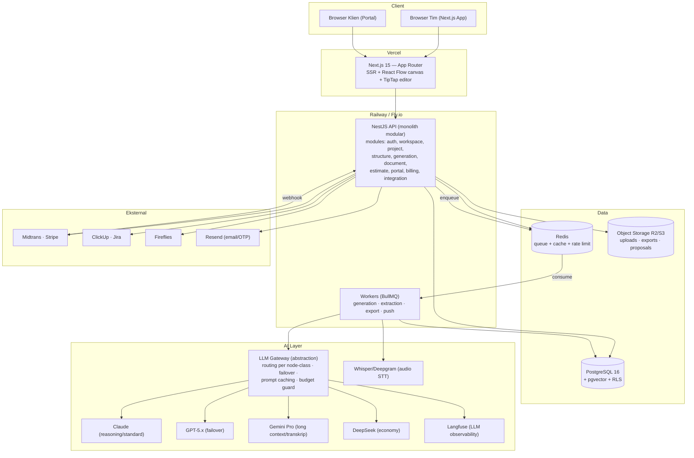
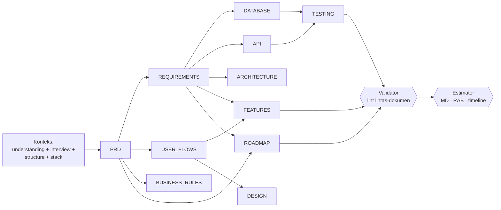

# ARCHITECTURE.md: Spectra

## Ringkasan

Spectra dibangun sebagai **monolith modular** (sesuai complexity governor-nya sendiri — proyek kelas 3): satu backend NestJS dengan modul terpisah jelas, satu frontend Next.js, PostgreSQL tunggal, worker queue untuk pipeline AI. Semua akses model AI melalui satu abstraction layer provider-agnostic. Tidak ada microservices di v1 — pemisahan layanan hanya bila metrik beban membuktikan perlu.

## Diagram Arsitektur

## Keputusan Arsitektur (ADR ringkas)

| # | Keputusan | Alasan | Alternatif ditolak |
|---|---|---|---|
| ADR-1 | Monolith modular NestJS | Tim kecil, iterasi cepat, domain masih berubah | Microservices (overhead ops tak sebanding di v1) |
| ADR-2 | Pipeline sebagai DAG di BullMQ flows | Dependensi antar dokumen eksplisit, retry per node, resume murah | Satu prompt raksasa (tidak konsisten, tak bisa selektif); Temporal (bagus tapi ops berat untuk v1) |
| ADR-3 | LLM Gateway sendiri di atas Vercel AI SDK | Routing per node-class, failover, budget guard, ganti model tanpa refactor | Hard-code satu vendor (lock-in, margin rapuh) |
| ADR-4 | PostgreSQL tunggal + RLS untuk multi-tenant | Isolasi kuat tanpa kompleksitas sharding; pgvector cukup untuk RAG | DB per tenant (ops mahal); vector DB terpisah (belum perlu) |
| ADR-5 | Konten dokumen = markdown di kolom `content_md` | Sumber kebenaran portabel, mudah diff/export/agent-ready | CRDT/rich-text propriety (kunci vendor, sulit diff) |
| ADR-6 | Portal klien = route group di app yang sama, token-scoped | Hemat infra, share komponen render dokumen | App terpisah (duplikasi; belum perlu sampai white-label domain custom) |
| ADR-7 | SSE untuk progres generasi | Sederhana, cukup untuk one-way streaming; fallback polling | WebSocket penuh (belum ada kebutuhan bidireksional berat) |

## Pipeline Generasi (detail)

- Tiap node = 1 job BullMQ: ambil konteks upstream (dengan prompt caching) → panggil GW dengan JSON schema → render markdown dari template → simpan `document_versions` → emit SSE.
- **Node-class routing (BR-50):** reasoning = PRD, ARCHITECTURE, impact analysis; standard = dokumen turunan; economy = validator, ekstraksi, ringkas. Mapping model per class ada di config runtime (dapat diubah tanpa deploy).
- **Selective regeneration:** graph di atas juga dependency map untuk impact analysis — perubahan REQUIREMENTS menandai DATABASE/API/ARCHITECTURE/FEATURES/TESTING/ROADMAP sebagai kandidat, LLM memfilter mana yang benar-benar terdampak, user mengkonfirmasi.

## Modul Backend

| Modul | Tanggung jawab |
|---|---|
| `auth` | Better Auth (email, Google), sesi JWT, guard role |
| `workspace` | Tenant, member, rate card, preset, template, audit |
| `project` | CRUD proyek, input & ekstraksi (STT, parsing), understanding, interview |
| `structure` | Node canvas, scope, simulasi estimasi kasar |
| `generation` | Run/node DAG, orkestrasi worker, SSE, resume, budget guard |
| `document` | Versi, diff, translate, health findings, chat & impact |
| `estimate` | Kalkulasi bottom-up, override, timeline, proposal render (docx-templates) |
| `portal` | Share token, OTP, komentar, approval, baseline, CR |
| `billing` | Plan, kredit ledger, checkout, webhook Midtrans/Stripe |
| `integration` | OAuth ClickUp/Jira/Fireflies, push idempotent |
| `export` | ZIP/PDF/DOCX/agent-pack builder |

## Keamanan

- RLS PostgreSQL pada semua tabel ber-`workspace_id`; service role hanya di worker dengan scope terbatas.
- Enkripsi: TLS 1.2+; kolom sensitif (`integrations.auth`, transkrip) AES-256-GCM dengan key per-workspace (envelope, KMS).
- Portal: token 256-bit di-hash (bukan plaintext), OTP 6 digit TTL 10 menit, sesi 24 jam, rate limit ketat.
- Prompt injection guard: konten transkrip/RFP diperlakukan sebagai data (delimiter + instruksi sistem), bukan instruksi; output structured schema divalidasi.
- Secrets via environment manager (Railway/Doppler); tidak ada secret di repo.

## Skalabilitas & Reliabilitas

- Worker autoscale berdasarkan kedalaman queue; antrean fair per workspace (round-robin) agar satu tenant tidak memonopoli.
- Prompt caching (Anthropic/OpenAI/Gemini) untuk konteks upstream — target cache hit > 60% token input.
- Graceful degradation: provider AI down → failover class-equivalent; semua provider down → pipeline paused dengan notifikasi, bukan gagal.
- Backup PG harian (retensi 30 hari, PITR), object storage versioned (NFR-10).

## Lingkungan & CI/CD

- **Env:** local (docker-compose: pg, redis, minio, mailpit) → staging → production.
- **CI (GitHub Actions):** lint + typecheck + unit → integration (testcontainers) → e2e smoke (Playwright) → deploy staging otomatis; production via tag release.
- **Eval AI (lihat TESTING.md):** golden set berjalan di CI saat prompt/model berubah; regresi skor memblokir merge.
