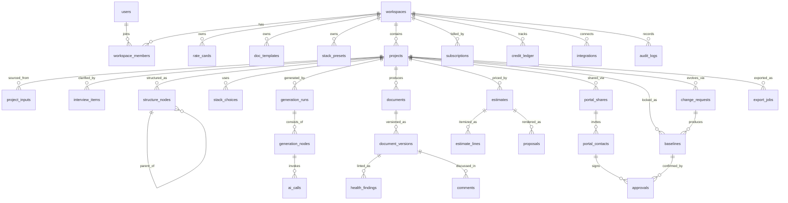

# DATABASE.md: Spectra

PostgreSQL 16 + pgvector. Semua tabel ber-`workspace_id` untuk isolasi multi-tenant (row-level security). PK memakai UUID v7. Kolom audit standar: `created_at`, `updated_at`, `created_by`.

## Entity Relationship Diagram

## Tabel Inti

### Tenancy & Akses

| Tabel | Kolom kunci | Catatan |
|---|---|---|
| `users` | id, email (uniq), name, auth_provider, avatar_url | Identitas global lintas workspace |
| `workspaces` | id, name, slug, logo_url, brand_colors jsonb, locale, currency, margin_default, settings jsonb | Tenant |
| `workspace_members` | workspace_id, user_id, role enum(owner/admin/member), hide_prices bool | Uniq (workspace_id, user_id) |
| `audit_logs` | workspace_id, actor_id, action, entity_type, entity_id, meta jsonb, created_at | Append-only |

### Konfigurasi Perusahaan

| Tabel | Kolom kunci | Catatan |
|---|---|---|
| `rate_cards` | workspace_id, name, currency, is_default, roles jsonb `[{role, daily_rate}]`, margin_pct | Snapshot dicopy ke estimates |
| `doc_templates` | workspace_id, kind enum(proposal/document/portal), file_url, config jsonb | Template DOCX & tema portal |
| `stack_presets` | workspace_id, name, layers jsonb `[{layer, choice, note}]` | Preset stack perusahaan |

### Proyek & Input

| Tabel | Kolom kunci | Catatan |
|---|---|---|
| `projects` | workspace_id, name, client_name, status enum(draft/generating/ready/shared/approved/archived), complexity smallint(1-5), language, scope_mode enum(mvp/full), health_score smallint | |
| `project_inputs` | project_id, kind enum(idea/transcript/rfp/audio/fireflies), file_url, raw_text, extracted jsonb, embedding vector(1536), status | Sumber requirement; embedding untuk RAG |
| `interview_items` | project_id, seq, question, reason, impact_refs jsonb, options jsonb, answer_text, skipped bool, assumption_text | Skipped → assumption |
| `structure_nodes` | project_id, parent_id, kind enum(root/phase/feature/subfeature), title, description, position jsonb, phase_no, scope enum(mvp/full/parked), est_md numeric, sort | Adjacency list |
| `stack_choices` | project_id, layer, choice, justification, alternatives jsonb, source enum(ai/preset/user) | ADR-style |

### Generasi & Dokumen

| Tabel | Kolom kunci | Catatan |
|---|---|---|
| `generation_runs` | project_id, trigger enum(full/selective/impact), status enum(queued/running/paused/error/done), credit_cost numeric, started_at, finished_at | |
| `generation_nodes` | run_id, doc_key, depends_on jsonb, status, attempt, error_text | Node DAG per dokumen |
| `ai_calls` | node_id, provider, model, prompt_version, tokens_in, tokens_out, cost_usd, latency_ms, cache_hit bool | Telemetry (mirror ke Langfuse) |
| `documents` | project_id, doc_key (PRD/REQUIREMENTS/…), title, current_version_id, status enum(draft/internal_review/shared/approved), share_visible bool, hide_prices bool | |
| `document_versions` | document_id, version_no, content_md, content_en_md, source enum(ai/user/merge), generated_meta jsonb, is_baselined bool | Immutable |
| `health_findings` | project_id, version_id, rule_key, severity enum(info/warning/critical), location, message, suggestion, resolved bool | |

### Estimasi & Proposal

| Tabel | Kolom kunci | Catatan |
|---|---|---|
| `estimates` | project_id, scope enum(mvp/full), rate_card_snapshot jsonb, total_md numeric, range_pct, total_cost numeric, currency, team_composition jsonb, duration_weeks, status enum(draft/snapshotted) | |
| `estimate_lines` | estimate_id, structure_node_id, role_breakdown jsonb `[{role, md}]`, md numeric, cost numeric, overridden bool, override_reason | Bottom-up per fitur |
| `proposals` | project_id, estimate_id, file_docx_url, file_pdf_url, rab_xlsx_url, generated_at | |

### Portal, Approval & CR

| Tabel | Kolom kunci | Catatan |
|---|---|---|
| `portal_shares` | project_id, token_hash, expires_at, revoked_at, doc_keys jsonb, hide_prices bool, primary_contact_id | |
| `portal_contacts` | share_id, email, name, is_primary_approver bool, last_otp_at | Maks 5/proyek (BR-40) |
| `comments` | project_id, version_id, section_anchor, author_kind enum(member/client), author_ref, body, parent_id, status enum(open/resolved) | |
| `approvals` | baseline_id, contact_id, otp_verified_at, ip, user_agent | Jejak legal |
| `baselines` | project_id, seq_no, doc_versions jsonb, total_cost, duration_weeks, assumptions jsonb, content_hash, change_request_id nullable | Immutable (BR-24) |
| `change_requests` | project_id, cr_no, description, impact jsonb `{docs, delta_md, delta_cost, delta_weeks}`, status enum(proposed/sent/approved/rejected), requested_by_kind | |

### Billing & Integrasi

| Tabel | Kolom kunci | Catatan |
|---|---|---|
| `subscriptions` | workspace_id, plan enum(free/starter/pro/team), seats, period_start/end, provider enum(midtrans/stripe), provider_ref, status | |
| `credit_ledger` | workspace_id, delta numeric, kind enum(plan_grant/topup/consume/refund/expire), ref_type, ref_id, expires_at, idempotency_key uniq | Saldo = Σ delta |
| `integrations` | workspace_id, provider enum(clickup/jira/fireflies/…), auth jsonb (encrypted), status | |
| `integration_pushes` | project_id, integration_id, mapping jsonb `[{node_id, external_id, url}]`, status, report jsonb | Idempotent push (FR-22) |
| `export_jobs` | project_id, kind enum(zip/pdf/docx/agent_pack), file_url, status | |

## Indeks & Kinerja

- Semua FK terindeks; tambahan: `documents(project_id, doc_key)` uniq, `document_versions(document_id, version_no)` uniq, `credit_ledger(workspace_id, created_at)`, `comments(project_id, status)`, `structure_nodes(project_id, parent_id)`.
- `project_inputs.embedding` memakai HNSW index (pgvector) untuk pencarian konteks saat chat/impact analysis.
- Partisi bulanan untuk `ai_calls` dan `audit_logs` (volume tinggi, akses per-periode).

## Retensi & Penghapusan

- Soft-delete (`deleted_at`) untuk projects & documents; hard-delete file sumber (BR-42) menghapus objek storage + row `project_inputs`.
- Baseline, approvals, audit_logs: tidak pernah di-soft-delete (kebutuhan legal), ikut terhapus hanya saat workspace dihapus permanen (BR-05).
