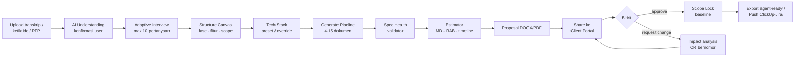

# USER_FLOWS.md: Spectra

Alur utama per peran. Notasi: **User** = aktor, → = aksi sistem.

## 1. Alur Inti: Meeting → Blueprint → Proposal → Approval

## 2. PM/Analis — Membuat Blueprint dari Transkrip

1. **PM** klik "Buat dari transkrip meeting" di dashboard.
2. **PM** upload file audio meeting (60 mnt) + lampiran RFP klien.
3. Sistem mentranskripsi audio (diarization), mengekstrak teks RFP, menampilkan progres.
4. Sistem menampilkan panel **AI Understanding**: roles, fitur (dengan kutipan sumber), domain, kompleksitas, asumsi.
5. **PM** mengoreksi: menghapus 1 fitur yang salah tangkap, menambah 1 role.
6. Sistem mengajukan 7 pertanyaan adaptif; **PM** menjawab 5, melewati 2 (menjadi asumsi tercatat).
7. Sistem membangun **Structure Canvas**; **PM** memindah 2 fitur ke Fase 3 dan menandai scope MVP.
8. **PM** memilih preset "Stack Standar Perusahaan", meng-override layer payment.
9. **PM** klik "Generate Blueprint" → pipeline berjalan; PM menutup laptop.
10. Notifikasi email "Blueprint selesai · Spec Health 88 · 3 temuan" → **PM** membuka workspace, memperbaiki 1 temuan critical via "fix with AI".

## 3. Owner — Estimasi, Proposal & Kirim ke Klien

1. **Owner** membuka tab Estimasi pada proyek yang sudah digenerate.
2. Sistem menampilkan MD per fitur (confidence range), komposisi tim, RAB dari rate card default, timeline gantt.
3. **Owner** meng-override MD modul integrasi (naik 4 MD, alasan tercatat) → RAB terupdate real-time.
4. **Owner** membandingkan skenario MVP (Rp 313 jt) vs Full (Rp 486 jt), memilih menawarkan keduanya.
5. **Owner** klik "Generate Proposal" → DOCX white-label + RAB Excel tergenerate.
6. **Owner** menandai dokumen yang di-share (menyembunyikan API.md & TESTING.md), memasukkan email klien, mengirim portal link.
7. Sistem mengirim email undangan ke klien dengan OTP.

## 4. Klien — Review & Approve di Portal

1. **Klien** membuka link, memasukkan OTP dari email.
2. Portal menampilkan dokumen ber-branding perusahaan: Ringkasan, Kebutuhan Fitur, Alur + Wireframe, Timeline & Biaya.
3. **Klien** membaca wireframe alur kasir, menulis komentar pada section pembayaran: "bisa tambah transfer bank manual?"
4. Tim mendapat notifikasi; **Owner** membalas dengan simulasi dampak (+3 MD, +Rp 12 jt) dan menawarkan masuk scope.
5. **Klien** setuju → **Owner** menerapkan perubahan (impact analysis → regenerate 3 dokumen → RAB terupdate) → portal menampilkan versi baru dengan diff ringkas "apa yang berubah".
6. **Klien** klik "Approve Semua" → verifikasi OTP ulang → sistem membuat **baseline snapshot** (versi dokumen + RAB + timeline, immutable).
7. Kedua pihak menerima email konfirmasi approval berisi ringkasan baseline.

## 5. Klien — Change Request Pasca-Approval

1. **Klien** membuka portal (proyek berstatus Approved), klik "Minta Perubahan".
2. **Klien** menulis: "Tambah fitur member & poin loyalti."
3. Sistem menjalankan impact analysis: 4 dokumen terdampak, +12 MD, +Rp 47 jt, +2 minggu.
4. **Owner** mereview, menyetujui estimasi, mengirim CR-001 ke klien.
5. **Klien** approve CR-001 → baseline v2 terbentuk; CR tercatat dengan jejak lengkap untuk penagihan.

## 6. Engineer — Handoff ke Eksekusi

1. **Engineer** membuka proyek Approved, klik Export → "Agent-ready pack".
2. Sistem menghasilkan `CLAUDE.md`, `.cursorrules`, `AGENTS.md`, `tasks.md` + ZIP seluruh dokumen.
3. **Engineer** klik "Push ke ClickUp" → memilih space/folder → sistem membuat epic per fase, task per fitur dengan acceptance criteria & estimasi.
4. **Engineer** meng-clone repo baru, menaruh agent pack, mulai eksekusi dengan Claude Code; setiap task ClickUp menaut balik ke section dokumen di Spectra.

## 7. Owner — Setup Workspace (onboarding)

1. **Owner** daftar (email/Google), membuat workspace, memilih paket (mulai Free).
2. Wizard onboarding: upload logo & warna (untuk proposal + portal white-label) → isi rate card (atau pakai template default IDR) → set preset tech stack (opsional) → undang anggota.
3. Sistem menyediakan 1 proyek contoh (sample) agar tim bisa eksplorasi tanpa memakai kredit.

## 8. Alur Kegagalan Penting

- **Generasi gagal di tengah** → status "paused-error", dokumen selesai tetap ada, tombol "lanjutkan" mengulang hanya node gagal; kredit tidak terpotong dobel.
- **OTP klien tidak sampai** → resend dengan cooldown 60 dtk; alternatif verifikasi via link ajaib (magic link) ke email yang sama.
- **Kuota habis saat generate** → dialog top-up inline; pipeline resume otomatis setelah pembayaran terkonfirmasi webhook.
- **Push ClickUp gagal sebagian** → laporan per-item (sukses/gagal + alasan); retry hanya item gagal.
